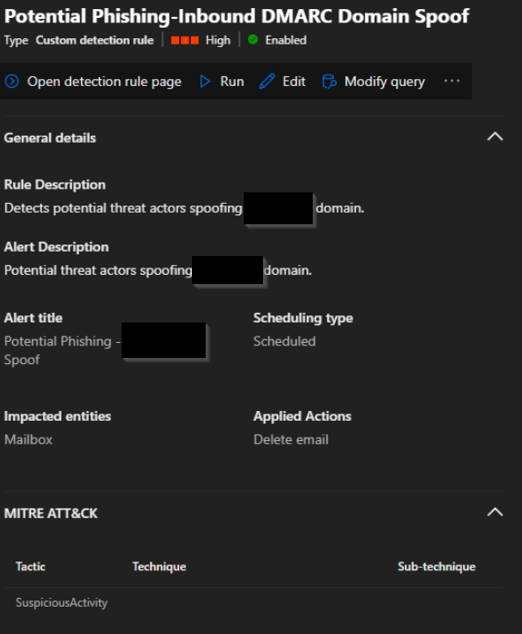
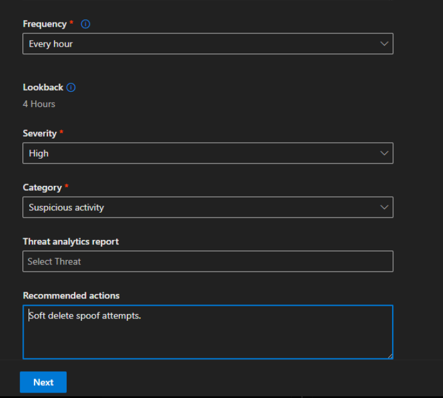
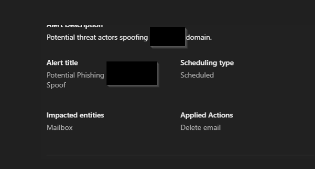

# 🚨 Inbound DMARC Domain Spoof – Auth Failure Correlation

## 🧠 Purpose
Detects inbound email spoofing attempts targeting the organization’s domain by correlating SPF, DKIM, and DMARC authentication failures along with Composite Authentication (CompAuth).

Designed for high-confidence detection and automated containment after proper tuning.

---

## 🖼️ Detection Overview

  
  

---

## ⚙️ Detection Logic

Full query available here:  
[View full query](../kql/inbound-dmarc-domain-spoof.kql)

---

## 🔥 Rule Highlights

- Runs hourly (scheduled detection)  
- High severity  
- Correlates SPF/DKIM/DMARC failures  
- Uses Composite Authentication (CompAuth)  
- Mailbox entity mapping (recipient)  
- Supports automated remediation (soft delete / hard delete / move to folder)  

---

## 🎯 Security Impact

Domain spoofing is a common phishing technique used to impersonate trusted organizations and bypass user awareness.

By correlating multiple authentication signals, this detection reduces false positives and increases confidence, enabling safe automation of remediation actions.

---

## 🧪 Tuning Considerations

- Validate against legitimate third-party senders (marketing platforms, ticketing systems, etc.)  
- Monitor initial alerts before enabling automated remediation  
- Adjust thresholds based on organizational email patterns  

---

## 🛡️ MITRE ATT&CK Mapping

- **Technique:** T1566.002 – Phishing: Spearphishing Link  
- **Tactic:** Initial Access  

---

## 💡 Notes

This detection was designed with a focus on balancing **high fidelity** and **automated response**, ensuring minimal user impact while protecting against real-world phishing threats.
