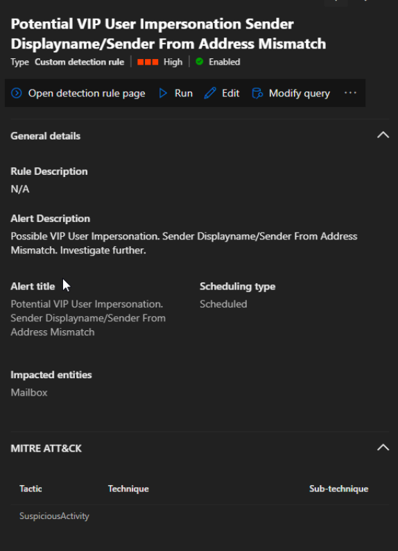
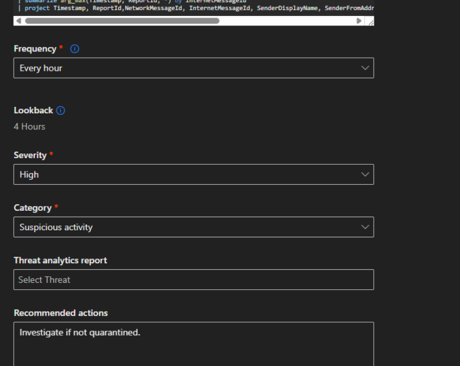
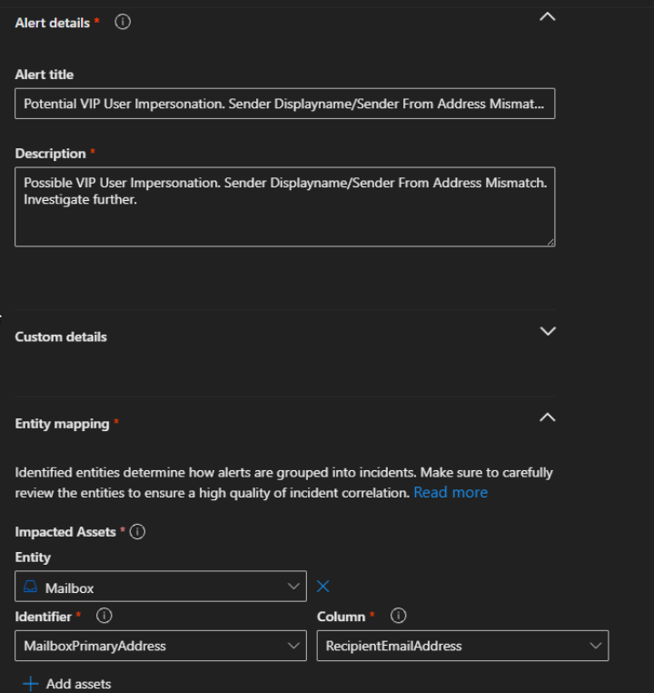

# 🚨 VIP Display Name Impersonation – Sender Mismatch Detection

## 🧠 Purpose
Detects potential business email compromise (BEC) attacks where a trusted executive or VIP display name is used but the message originates from an unauthorized sender.

---

## 🖼️ Detection Overview

  
  

---

## ⚙️ Detection Logic

Full query available here:  
[View full query](../kql/vip-displayname-impersonation.kql)

---

## 🔥 Rule Highlights

- Runs hourly  
- High severity  
- Mailbox entity mapping  
- Supports automated remediation  

---

## 🎯 Security Impact

This detection helps identify high-risk phishing attempts targeting executives and privileged users, a common technique used in BEC attacks to bypass user trust.
